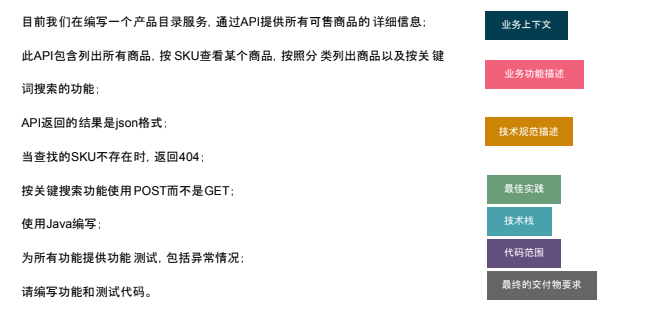

## Homework:Story I
作为一名在线购物平台的客户,我希望能够查看商品列表,以便于我能挑 选到心仪的商品

### 后端,完成API:
- 参数包括页码,默认为1,商品条目,默认为15,最大为30
- 返回信息包括图片地址,商品名,价格, 库存等信息。
  
### 前端(可选):
- 一页显示15个商品
- 每个商品显示图片,商品名,价格, 库存等信息。
- 商品下方显示页码信息。

## Example

- 目前我们在编写一个产品目录服务,通过API提供所有可售商品的 详细信息;

- 此API包含列出所有商品,按 SKU查看某个商品,按照分 类列出商品以及按关键词搜索的功能;

- API返回的结果是json格式;

- 当查找的SKU不存在时,返回404;

- 按关键搜索功能使用POST而不是GET;

- 使用Java编写;

- 为所有功能提供功能 测试,包括异常情况;

- 请编写功能和测试代码。